# System Design Interview Skill

> Master the 4S Framework, 20+ Real-World Case Studies, Capacity Estimation, and AI-Powered Practice

## Overview

This skill provides comprehensive preparation for System Design Interviews (SDIs) at top tech companies. It synthesizes proven methodologies, real-world architecture patterns, and interactive practice tools to help you ace any system design challenge.

---

## Table of Contents

1. [The 4S Framework](#1-the-4s-framework)
2. [20 Case Studies with Mermaid Templates](#2-case-studies-with-mermaid-templates)
3. [Capacity Estimation Formulas](#3-capacity-estimation-formulas)
4. [AI Simulation Prompts](#4-ai-simulation-prompts)
5. [Pre-Interview Checklist](#5-pre-interview-checklist)
6. [Quick Reference Cards](#6-quick-reference-cards)

---

## 1. The 4S Framework

The 4S Framework is a structured approach to solving any system design interview problem:

### 4S = Scenario → Service → Storage → Scale

### Step 1: Scenario

**Identify what we're building and gather requirements.**

```markdown
## Scenario Questions
- What is the core feature/product?
- Who are the users and what are their needs?
- What are the key user interactions?
- What's the scale expectation (DAU, MAU, requests/sec)?
- What are the latency/SLA requirements?
```

**Checklist:**
- [ ] Clarify functional requirements
- [ ] Identify non-functional requirements (performance, availability, scalability)
- [ ] Estimate scale (users, data volume, traffic)
- [ ] Define success metrics

### Step 2: Service

**Break down the system into services/components.**

```markdown
## Service Decomposition
- API Gateway / Load Balancer
- Application Services (business logic)
- Data Services (databases, caches)
- Messaging/Queue services
- External integrations
```

**Design Principles:**
- Single Responsibility Principle
- Loose coupling, high cohesion
- API-first design
- Service boundaries based on data ownership

### Step 3: Storage

**Choose the right data storage for each data type.**

```markdown
## Storage Selection Matrix

| Data Type | Best Fit | Alternatives |
|-----------|----------|--------------|
| User Profiles | SQL (PostgreSQL) | NoSQL (DynamoDB) |
| Social Graph | Graph DB (Neo4j) | Wide-column (Cassandra) |
| Time-series | TimescaleDB | InfluxDB |
| Media/Binary | Object Storage (S3) | CDN |
| Cache | Redis/Memcached | - |
| Search | Elasticsearch | Solr |
| Messages/Logs | Kafka | RabbitMQ |
```

### Step 4: Scale

**Address scalability, availability, and performance.**

```markdown
## Scale Solutions

### Vertical Scaling
- Increase server resources (CPU, RAM, disk)
- Quick fix, limited by hardware

### Horizontal Scaling
- Add more servers
- Load balancing required
- Preferred approach

### Database Scaling
- Read replicas
- Sharding strategies
- Partitioning schemes

### Caching Layers
- CDN (edge caching)
- Application cache (Redis)
- Query cache
- Object cache

### Data Replication
- Master-slave
- Multi-master
- Quorum-based (Cassandra)
```

---

## 2. Case Studies with Mermaid Templates

### Case Study 1: Design a URL Shortener (e.g., Bitly)

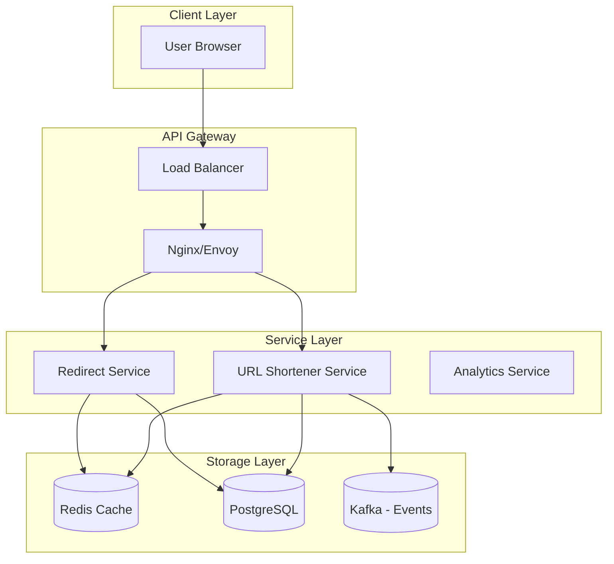
```mermaid
flowchart TB
    subgraph Client["Client Layer"]
        A[User Browser]
    end
    
    subgraph Gateway["API Gateway"]
        B[Load Balancer]
        C[Nginx/Envoy]
    end
    
    subgraph Services["Service Layer"]
        D[URL Shortener Service]
        E[Redirect Service]
        F[Analytics Service]
    end
    
    subgraph Storage["Storage Layer"]
        G[(Redis Cache)]
        H[(PostgreSQL)]
        I[(Kafka - Events)]
    end
    
    A --> B --> C --> D
    C --> E
    D --> G
    D --> H
    D --> I
    E --> G
    E --> H
```

**Key Components:**
- **Hash function**: Base62 encoding, collision handling
- **Storage**: URL mapping with short code as key
- **Analytics**: Click tracking, geolocation, device stats

---

### Case Study 2: Design a Rate Limiter

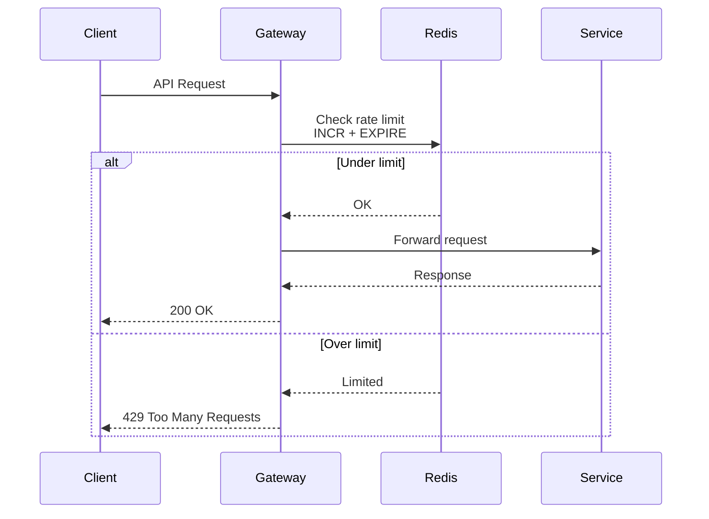
```mermaid
sequenceDiagram
    participant Client
    participant Gateway
    participant Redis
    participant Service
    
    Client->>Gateway: API Request
    Gateway->>Redis: Check rate limit<br/>INCR + EXPIRE
    alt Under limit
        Redis-->>Gateway: OK
        Gateway->>Service: Forward request
        Service-->>Gateway: Response
        Gateway-->>Client: 200 OK
    else Over limit
        Redis-->>Gateway: Limited
        Gateway-->>Client: 429 Too Many Requests
    end
```

**Rate Limiting Algorithms:**
- Token Bucket
- Leaking Bucket
- Fixed Window
- Sliding Window
- Sliding Window Log

---

### Case Study 3: Design a Distributed Cache

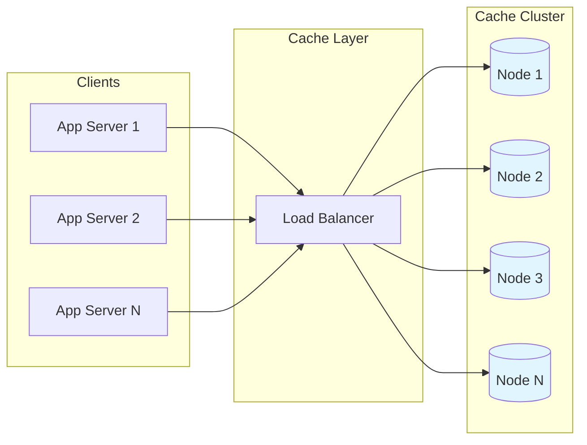
```mermaid
flowchart LR
    subgraph Client["Clients"]
        C1[App Server 1]
        C2[App Server 2]
        C3[App Server N]
    end
    
    subgraph Cache["Cache Layer"]
        L[Load Balancer]
    end
    
    subgraph Nodes["Cache Cluster"]
        N1[(Node 1)]
        N2[(Node 2)]
        N3[(Node 3)]
        N4[(Node N)]
    end
    
    C1 & C2 & C3 --> L --> N1 & N2 & N3 & N4
    
    style N1 fill:#e1f5fe
    style N2 fill:#e1f5fe
    style N3 fill:#e1f5fe
    style N4 fill:#e1f5fe
```

**Consistent Hashing Ring:**
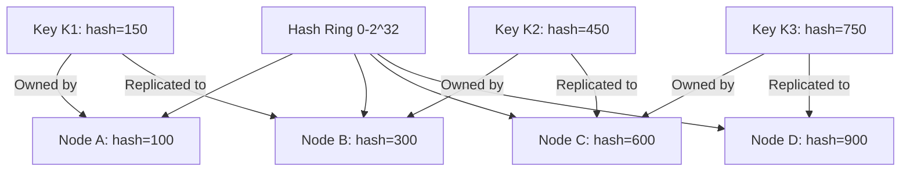
```mermaid
graph TD
    A[Hash Ring 0-2^32] --> B[Node A: hash=100]
    A --> C[Node B: hash=300]
    A --> D[Node C: hash=600]
    A --> E[Node D: hash=900]
    
    F[Key K1: hash=150] -->|Owned by| B
    F -->|Replicated to| C
    G[Key K2: hash=450] -->|Owned by| C
    G -->|Replicated to| D
    H[Key K3: hash=750] -->|Owned by| D
    H -->|Replicated to| E
```

---

### Case Study 4: Design Twitter/Tweet System

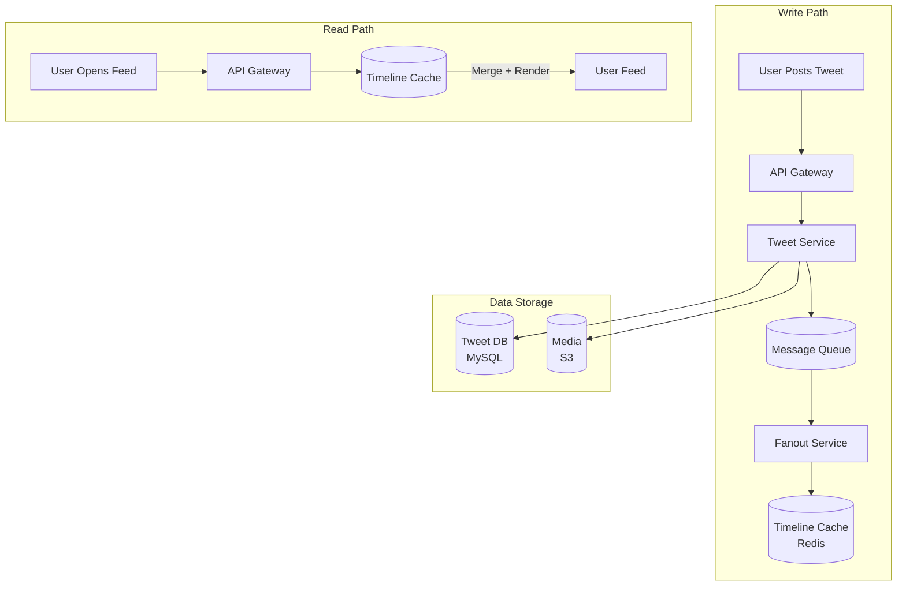
```mermaid
flowchart TB
    subgraph Write["Write Path"]
        U[User Posts Tweet] --> API[API Gateway]
        API --> TS[Tweet Service]
        TS --> Q[(Message Queue)]
        Q --> FS[Fanout Service]
        FS --> TF[(Timeline Cache<br/>Redis)]
    end
    
    subgraph Read["Read Path"]
        U2[User Opens Feed] --> API2[API Gateway]
        API2 --> TF2[(Timeline Cache)]
        TF2 -->|Merge + Render| UI[User Feed]
    end
    
    subgraph Storage["Data Storage"]
        TS --> DB[(Tweet DB<br/>MySQL)]
        TS --> S3[(Media<br/>S3)]
    end
```

**Timeline Generation Strategies:**

| Strategy | Pros | Cons |
|----------|------|------|
| Push (Fanout on Write) | Fast reads | Slow writes, hot users |
| Pull (Fanout on Read) | Fast writes | Slow reads |
| Hybrid | Balanced | Complex |

---

### Case Study 5: Design a Chat System (WhatsApp/Slack)

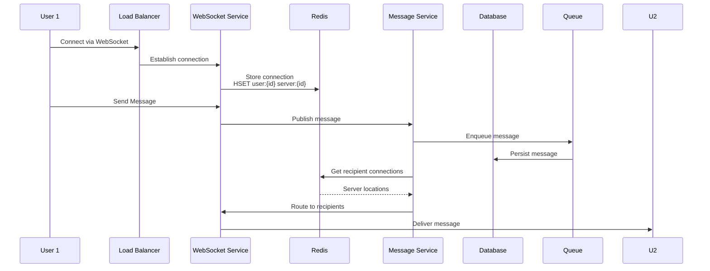
```mermaid
sequenceDiagram
    participant U1 as User 1
    participant LB as Load Balancer
    participant WS as WebSocket Service
    participant RM as Redis
    participant MSG as Message Service
    participant DB as Database
    participant Q as Queue
    
    U1->>LB: Connect via WebSocket
    LB->>WS: Establish connection
    WS->>RM: Store connection<br/>HSET user:{id} server:{id}
    
    U1->>WS: Send Message
    WS->>MSG: Publish message
    MSG->>Q: Enqueue message
    Q->>DB: Persist message
    
    MSG->>RM: Get recipient connections
    RM-->>MSG: Server locations
    MSG->>WS: Route to recipients
    WS->>U2: Deliver message
```

**Key Features:**
- WebSocket for real-time bidirectional communication
- Redis for connection state and pub/sub
- Message persistence with acknowledgments
- Typing indicators, read receipts

---

### Case Study 6: Design an E-commerce Inventory System

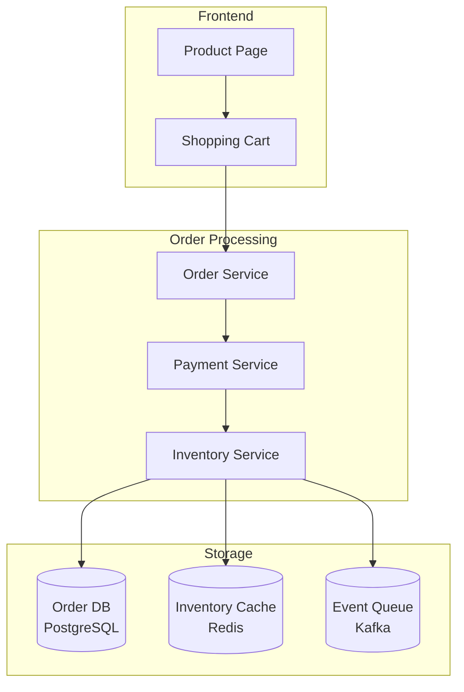
```mermaid
flowchart TB
    subgraph Frontend
        UI[Product Page]
        Cart[Shopping Cart]
    end
    
    subgraph Order["Order Processing"]
        OS[Order Service]
        PS[Payment Service]
        IS[Inventory Service]
    end
    
    subgraph Storage
        RDBMS[(Order DB<br/>PostgreSQL)]
        Cache[(Inventory Cache<br/>Redis)]
        Queue[(Event Queue<br/>Kafka)]
    end
    
    UI --> Cart --> OS
    OS --> PS
    PS --> IS
    IS --> Cache
    IS --> RDBMS
    IS --> Queue
```

**Inventory Management:**
- Optimistic locking for concurrent updates
- Reserve-then-confirm pattern
- Idempotency keys for duplicate prevention

---

### Case Study 7: Design a Video Streaming Service (YouTube/Netflix)

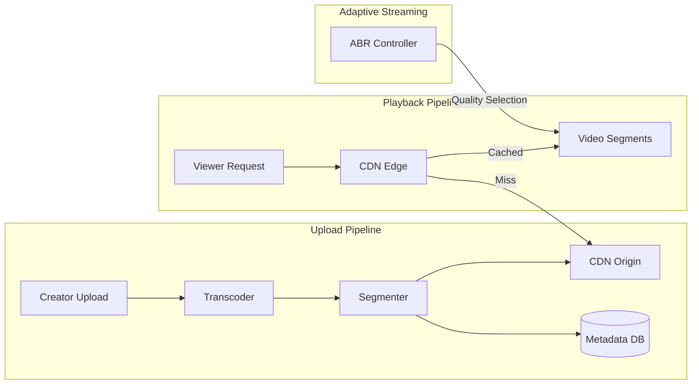
```mermaid
flowchart LR
    subgraph Upload["Upload Pipeline"]
        U[Creator Upload] --> Trans[Transcoder]
        Trans --> Mux[Segmenter]
        Mux --> CDN[CDN Origin]
        Mux --> DB[(Metadata DB)]
    end
    
    subgraph Playback["Playback Pipeline"]
        P[Viewer Request] --> LB[CDN Edge]
        LB --> |Cached| Video[Video Segments]
        LB --> |Miss| CDN
    end
    
    subgraph Adaptive["Adaptive Streaming"]
        ABR[ABR Controller] --> |Quality Selection| Video
    end
```

**Key Metrics:**
- Bitrate adaptation based on bandwidth
- CDN edge caching for low latency
- Multiple quality renditions (360p to 4K)

---

### Case Study 8: Design a Notification System

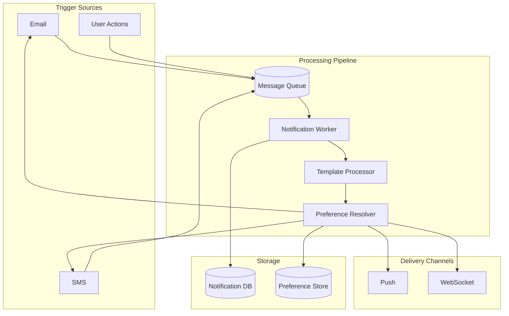
```mermaid
flowchart TB
    subgraph Trigger["Trigger Sources"]
        E[Events]
        S[Scheduled Jobs]
        U[User Actions]
    end
    
    subgraph Pipeline["Processing Pipeline"]
        Q[(Message Queue)]
        NW[Notification Worker]
        TP[Template Processor]
        PR[Preference Resolver]
    end
    
    subgraph Delivery["Delivery Channels"]
        P[Push]
        E[Email]
        S[SMS]
        WS[WebSocket]
    end
    
    subgraph Storage
        ND[(Notification DB)]
        PS[(Preference Store)]
    end
    
    E & S & U --> Q --> NW --> TP
    TP --> PR --> P & E & S & WS
    PR --> PS
    NW --> ND
```

---

### Case Study 9: Design a Search Engine

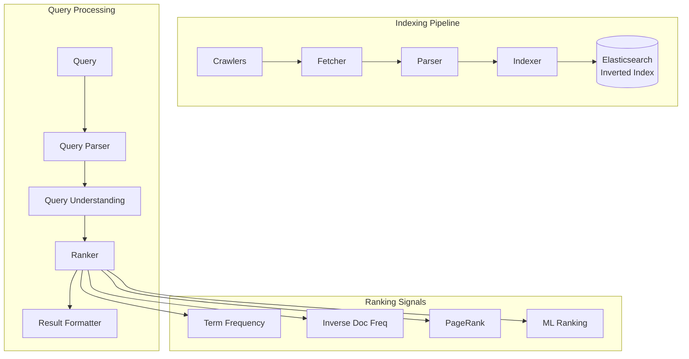
```mermaid
flowchart TB
    subgraph Indexing["Indexing Pipeline"]
        C[Crawlers] --> F[Fetcher]
        F --> P[Parser]
        P --> I[Indexer]
        I --> ES[(Elasticsearch<br/>Inverted Index)]
    end
    
    subgraph Query["Query Processing"]
        Q[Query] --> QL[Query Parser]
        QL --> QF[Query Understanding]
        QF --> RS[Ranker]
        RS --> SF[Result Formatter]
    end
    
    subgraph Ranking["Ranking Signals"]
        TF[Term Frequency]
        IDF[Inverse Doc Freq]
        PR[PageRank]
        RL[ML Ranking]
    end
    
    RS --> TF & IDF & PR & RL
```

---

### Case Study 10: Design a Payment System

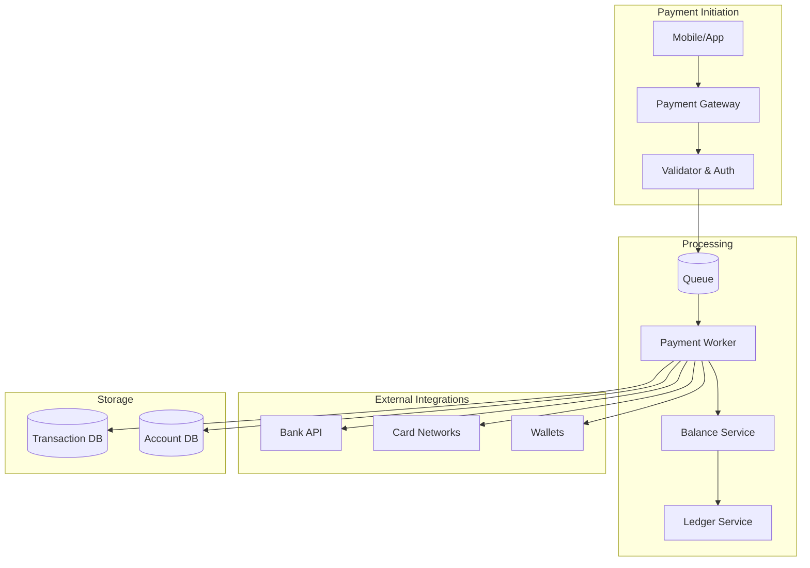
```mermaid
flowchart TB
    subgraph Initiate["Payment Initiation"]
        App[Mobile/App] --> PG[Payment Gateway]
        PG --> VA[Validator & Auth]
    end
    
    subgraph Process["Processing"]
        QM[(Queue)]
        WS[Payment Worker]
        BS[Balance Service]
        LS[Ledger Service]
    end
    
    subgraph External["External Integrations"]
        BK[Bank API]
        CC[Card Networks]
        WL[Wallets]
    end
    
    subgraph Storage
        TX[(Transaction DB)]
        AC[(Account DB)]
    end
    
    VA --> QM --> WS
    WS --> BS --> LS
    WS --> BK & CC & WL
    WS --> TX & AC
```

**Principles:**
- Idempotency everywhere
- Event sourcing for audit trail
- Two-phase commit avoidance (saga pattern)

---

### Case Study 11: Design a Distributed ID Generator

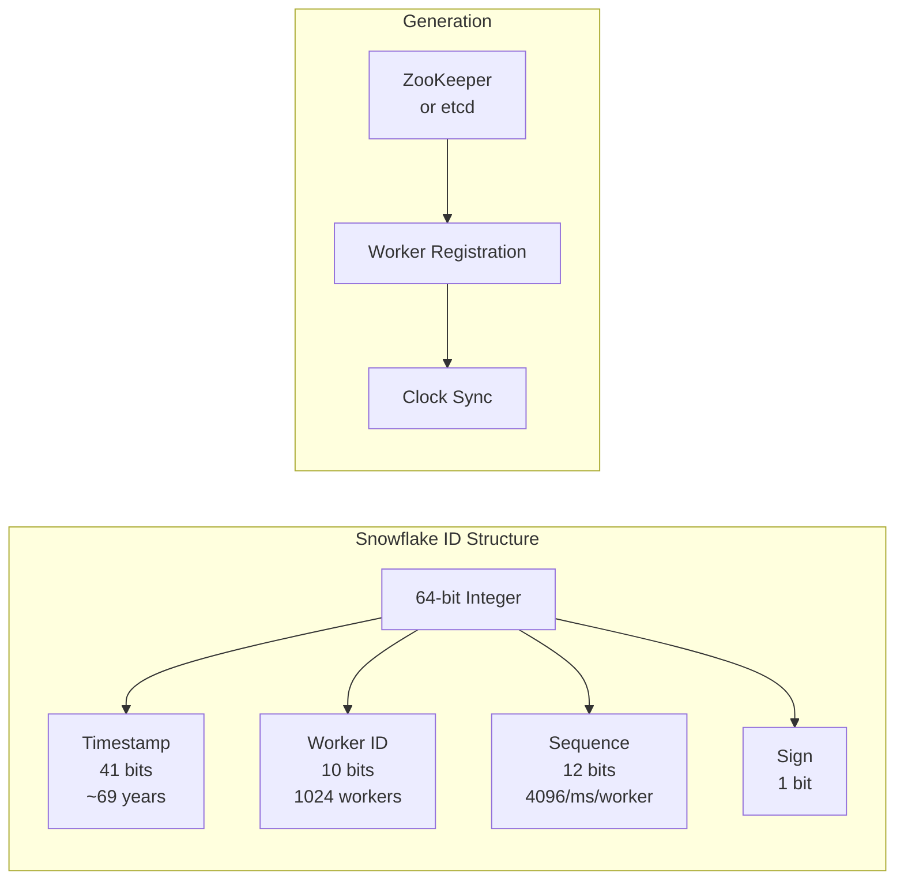
```mermaid
flowchart LR
    subgraph ID["Snowflake ID Structure"]
        direction TB
        S[64-bit Integer]
        S --> TS[Timestamp<br/>41 bits<br/>~69 years]
        S --> WS[Worker ID<br/>10 bits<br/>1024 workers]
        S --> SN[Sequence<br/>12 bits<br/>4096/ms/worker]
        S --> SG[Sign<br/>1 bit]
    end
    
    subgraph Generation["Generation"]
        ZK[ZooKeeper<br/>or etcd]
        ZK --> W[Worker Registration]
        W --> Clock[Clock Sync]
    end
```

---

### Case Study 12: Design a Web Crawler

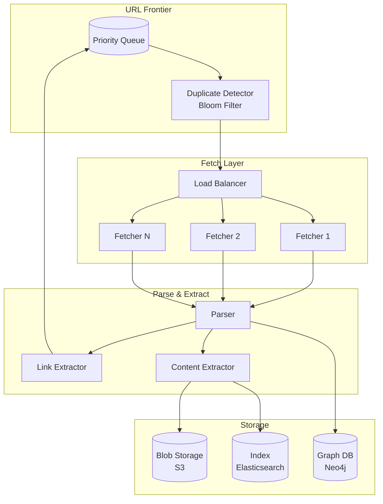
```mermaid
flowchart TB
    subgraph Frontier["URL Frontier"]
        Q[(Priority Queue)]
        D[Duplicate Detector<br/>Bloom Filter]
    end
    
    subgraph Fetch["Fetch Layer"]
        LB[Load Balancer]
        F1[Fetcher 1]
        F2[Fetcher 2]
        FN[Fetcher N]
    end
    
    subgraph Parse["Parse & Extract"]
        P[Parser]
        L[Link Extractor]
        C[Content Extractor]
    end
    
    subgraph Storage
        BQ[(Blob Storage<br/>S3)]
        IDX[(Index<br/>Elasticsearch)]
        GR[(Graph DB<br/>Neo4j)]
    end
    
    Q --> D --> LB
    LB --> F1 & F2 & FN
    F1 & F2 & FN --> P --> L & C
    L --> Q
    C --> BQ & IDX
    P --> GR
```

---

### Case Study 13: Design a Leader Election System

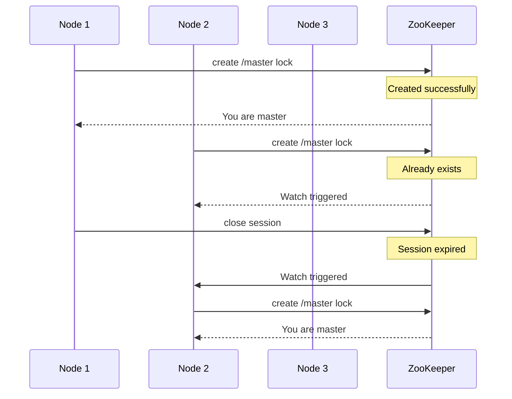
```mermaid
sequenceDiagram
    participant N1 as Node 1
    participant N2 as Node 2
    participant N3 as Node 3
    participant ZK as ZooKeeper
    
    N1->>ZK: create /master lock
    Note over ZK: Created successfully
    ZK-->>N1: You are master
    
    N2->>ZK: create /master lock
    Note over ZK: Already exists
    ZK-->>N2: Watch triggered
    
    N1->>ZK: close session
    Note over ZK: Session expired
    ZK->>N2: Watch triggered
    N2->>ZK: create /master lock
    ZK-->>N2: You are master
```

**Algorithms:**
- Paxos
- Raft
- Zab (ZooKeeper)
- Bully algorithm

---

### Case Study 14: Design a Social Media Feed (Instagram)

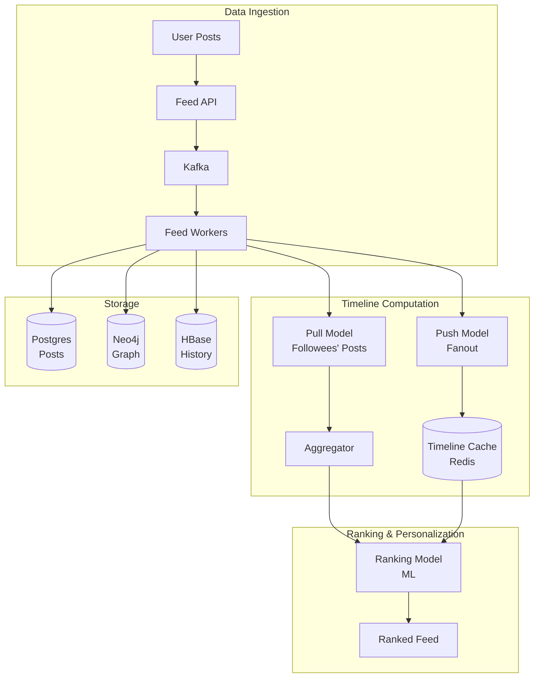
```mermaid
flowchart TB
    subgraph Ingest["Data Ingestion"]
        U[User Posts] --> API[Feed API]
        API --> Q[Kafka]
        Q --> F[Feed Workers]
    end
    
    subgraph Compute["Timeline Computation"]
        F --> PH[Pull Model<br/>Followees' Posts]
        F --> SH[Push Model<br/>Fanout]
        PH --> AG[Aggregator]
        SH --> TC[(Timeline Cache<br/>Redis)]
    end
    
    subgraph Rank["Ranking & Personalization"]
        AG --> RK[Ranking Model<br/>ML]
        TC --> RK
        RK --> RZ[Ranked Feed]
    end
    
    subgraph Storage
        P[(Postgres<br/>Posts)]
        G[(Neo4j<br/>Graph)]
        H[(HBase<br/>History)]
    end
    
    F --> P & G & H
```

---

### Case Study 15: Design a Distributed Logging System

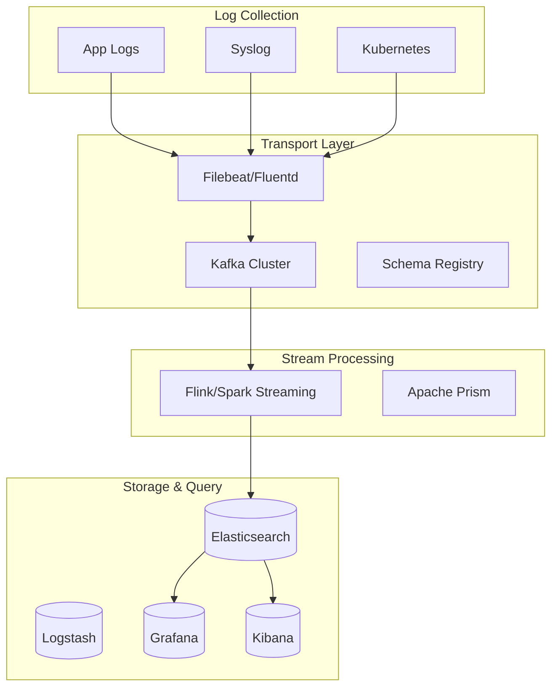
```mermaid
flowchart TB
    subgraph Collection["Log Collection"]
        A1[App Logs]
        S1[Syslog]
        K8[Kubernetes]
    end
    
    subgraph Transport["Transport Layer"]
        FB[Filebeat/Fluentd]
        KQ[Kafka Cluster]
        SC[Schema Registry]
    end
    
    subgraph Processing["Stream Processing"]
        FS[Flink/Spark Streaming]
        AP[Apache Prism]
    end
    
    subgraph Storage["Storage & Query"]
        ES[(Elasticsearch)]
        LS[(Logstash)]
        GB[(Grafana)]
        KI[(Kibana)]
    end
    
    A1 & S1 & K8 --> FB --> KQ --> FS --> ES
    ES --> KI & GB
```

---

### Case Study 16: Design a Calendar/Scheduling System

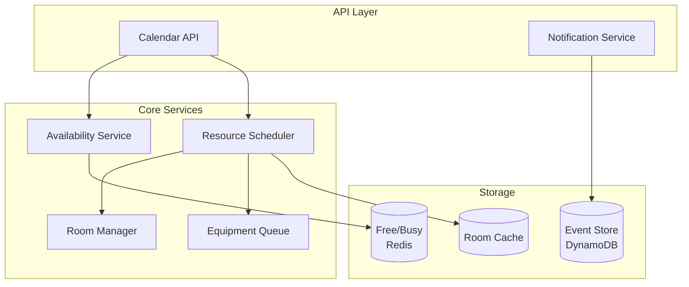
```mermaid
flowchart TB
    subgraph API["API Layer"]
        C[Calendar API]
        N[Notification Service]
    end
    
    subgraph Core["Core Services"]
        AS[Availability Service]
        RS[Resource Scheduler]
        RS --> RM[Room Manager]
        RS --> EQ[Equipment Queue]
    end
    
    subgraph Storage
        EV[(Event Store<br/>DynamoDB)]
        FR[(Free/Busy<br/>Redis)]
        RC[(Room Cache)]
    end
    
    C --> AS & RS
    AS --> FR
    RS --> RC
    N --> EV
```

**Conflict Detection:**
- Time-based partitioning
- Optimistic locking
- Vector clocks for ordering

---

### Case Study 17: Design a Ride-Sharing App (Uber/Lyft)

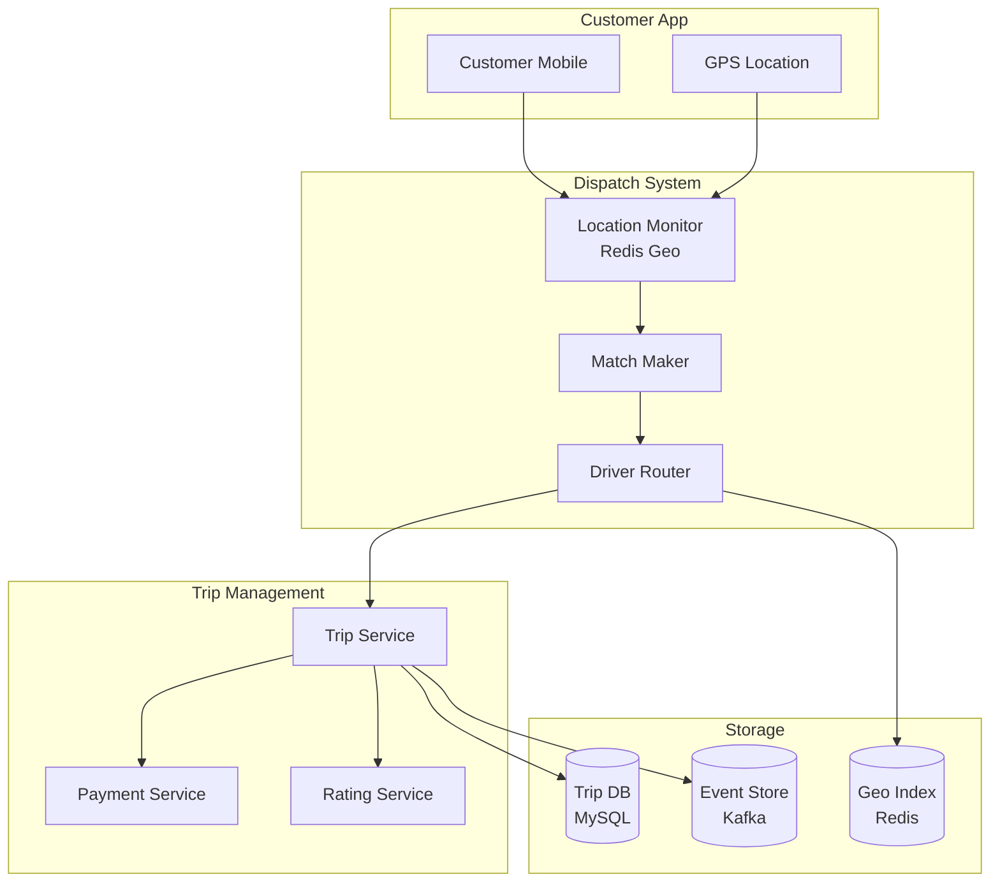
```mermaid
flowchart TB
    subgraph Customer["Customer App"]
        CM[Customer Mobile]
        GM[GPS Location]
    end
    
    subgraph Dispatch["Dispatch System"]
        LM[Location Monitor<br/>Redis Geo]
        MM[Match Maker]
        DR[Driver Router]
    end
    
    subgraph Trip["Trip Management"]
        TS[Trip Service]
        PS[Payment Service]
        RP[Rating Service]
    end
    
    subgraph Storage
        TR[(Trip DB<br/>MySQL)]
        GEO[(Geo Index<br/>Redis)]
        EV[(Event Store<br/>Kafka)]
    end
    
    CM & GM --> LM --> MM
    MM --> DR --> TS
    TS --> PS & RP
    TS --> TR & EV
    DR --> GEO
```

---

### Case Study 18: Design a Content Delivery Network (CDN)

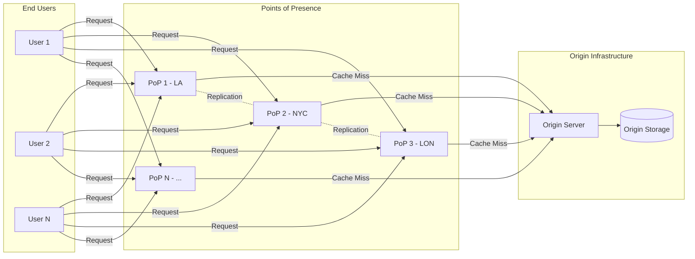
```mermaid
flowchart LR
    subgraph PoP["Points of Presence"]
        direction TB
        P1[PoP 1 - LA]
        P2[PoP 2 - NYC]
        P3[PoP 3 - LON]
        PN[PoP N - ...]
    end
    
    subgraph Origin["Origin Infrastructure"]
        O[Origin Server]
        OR[(Origin Storage)]
    end
    
    subgraph Users["End Users"]
        U1[User 1]
        U2[User 2]
        UN[User N]
    end
    
    U1 & U2 & UN --> |Request| P1 & P2 & P3 & PN
    P1 & P2 & P3 & PN --> |Cache Miss| O
    O --> OR
    
    P1 -.- |Replication| P2
    P2 -.- |Replication| P3
```

---

### Case Study 19: Design an API Gateway

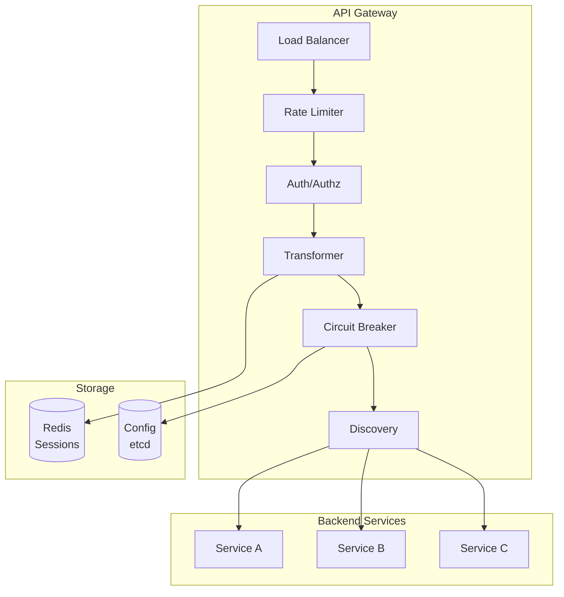
```mermaid
flowchart TB
    subgraph Gateway["API Gateway"]
        LB[Load Balancer]
        RL[Rate Limiter]
        AU[Auth/Authz]
        TR[Transformer]
        CB[Circuit Breaker]
        DP[Discovery]
    end
    
    subgraph Backend["Backend Services"]
        S1[Service A]
        S2[Service B]
        S3[Service C]
    end
    
    subgraph Storage
        RC[(Redis<br/>Sessions)]
        CF[(Config<br/>etcd)]
    end
    
    LB --> RL --> AU --> TR --> CB --> DP
    DP --> S1 & S2 & S3
    TR --> RC
    CB --> CF
```

**Features:**
- Request routing
- Protocol translation
- Authentication/Authorization
- Rate limiting
- Circuit breaking
- Request/response transformation

---

### Case Study 20: Design a Metrics Monitoring System

```mermaid
flowchart TB
    subgraph Collection["Metrics Collection"]
        H[Hosts/Containers]
        A[Applications]
        M[Middleware]
    end
    
    subgraph Ingest["Ingestion Layer"]
        AG[Agent/Collector]
        ET[Event Tracer]
        K[(Kafka)]
    end
    
    subgraph Process["Processing"]
        FL[Flink Processor]
        AGG[Aggregator]
        AL[Alert Engine]
    end
    
    subgraph Storage
        TS[(TimescaleDB<br/>Prometheus)]
        GR[(Grafana)]
        SL[(S3/Parquet)]
    end
    
    H & A & M --> AG & ET
    AG & ET --> K --> FL --> AGG
    AGG --> TS & SL
    FL --> AL --> GR
    TS --> GR
```

---

## 3. Capacity Estimation Formulas

### 3.1 Traffic Estimation

```markdown
## Request Volume Formulas

# Daily Active Users (DAU)
DAU = MAU × Activity_Rate
Example: 300M MAU × 70% daily = 210M DAU

# Requests per Second (RPS)
RPS = (DAU × Requests_Per_User) / 86400
Example: (210M × 10) / 86400 ≈ 24,306 RPS

# Peak RPS (assuming 3x average)
Peak_RPS = RPS × Peak_Factor
Example: 24,306 × 3 = 72,918 RPS

# Monthly Storage Growth
Monthly_Storage = DAU × Data_Per_User × 30
```

### 3.2 Database Estimation

```markdown
## Database Capacity

# MySQL/PostgreSQL
Rows_per_Table = Total_Records / Partition_Count
Max_Queries_per_Second = (Connections × Queries_per_Connection)

# Sharding Calculation
Shards_Needed = Total_Size / Max_Shard_Size
Example: 10TB / 500GB = 20 shards

# Replication Lag Tolerance
Read_Replica_OK = Update_to_Read_Delay < SLA_Latency

# Index Size Estimation
Index_Size = Row_Count × Index_Width × 1.3 (overhead)
```

### 3.3 Caching Estimation

```markdown
## Cache Capacity

# Cache Hit Ratio Target
Target_Hit_Ratio = 1 - (Cache_Miss_Latency / Direct_DB_Latency)
Example: 1 - (100ms / 50ms) = negative → need better cache!

# Memory Required
Cache_Size = (Unique_Keys × Avg_Value_Size) / Target_Hit_Ratio

# Redis Memory per Key
Memory_per_Key ≈ 96 bytes + Key_Size + Value_Size

# Cache Invalidation Window
Invalidation_Window = Event_Processing_Time + Propagation_Delay
```

### 3.4 Network Bandwidth

```markdown
## Bandwidth Calculations

# Inbound Traffic
Inbound_Mbps = (RPS × Avg_Request_Size × 8) / 1_000_000
Example: (72,918 × 2KB × 8) / 1M = 1,167 Mbps

# Outbound Traffic
Outbound_Mbps = Inbound_Mbps × Amplification_Factor
Example: 1,167 × 5 = 5,835 Mbps

# CDN Bandwidth Savings
CDN_Savings = Total_Requests × (1 - Cache_Hit_Ratio) × Response_Size
```

### 3.5 Storage Estimation

```markdown
## Object Storage (S3)

# Storage per User
Storage_per_User = (Media_Count × Avg_Size) + (DB_Records × Record_Size)

# S3 Cost Estimation
Monthly_Cost = (Storage_TB × $0.023) + (PUT_COUNT × $0.005/1000) + 
               (GET_COUNT × $0.0004/1000) + (Egress_TB × $0.09)

## Database Storage
DB_Storage = (Row_Count × Row_Size) / (1 - Index_Overhead) / (1 - Free_Space)
Example: (1B rows × 200 bytes) / 0.7 / 0.85 ≈ 336 GB
```

### 3.6 Queue/Message System

```markdown
## Message Queue Capacity

# Kafka Partition Throughput
Partitions_Needed = Peak_RPS / Max_Throughput_per_Partition
Example: 100,000 / 10,000 = 10 partitions

# Queue Depth Estimation
Queue_Depth = Average_RPS × Processing_Time × Safety_Factor
Example: 1000 × 0.5s × 3 = 1500 messages

# Retention Calculation
Retention_Storage = Messages_per_Second × Retention_Time × Avg_Message_Size
```

### 3.7 Latency & SLA

```markdown
## SLA Calculations

# Availability Percentages
| SLA      | Downtime/Year | Downtime/Month | Downtime/Week |
|----------|---------------|----------------|---------------|
| 99%      | 3.65 days     | 7.31 hours     | 1.68 hours    |
| 99.9%    | 8.76 hours    | 43.83 minutes  | 10.08 minutes |
| 99.99%   | 52.60 minutes | 4.38 minutes   | 1.01 minutes  |
| 99.999%  | 5.26 minutes  | 26.30 seconds  | 6.05 seconds  |

# P99 Latency from Average
P99 ≈ Average × 2.5 (for web services)
P99 ≈ Average × 4 (for database queries)

# Error Budget
Error_Budget = (1 - SLA) × Total_Requests
Allowed_Errors = Error_Budget × Monitoring_Window
```

### 3.8 Consistency & Replication

```markdown
## Replication Factor Decisions

# Quorum Calculation (for consensus systems)
Quorum = (Replication_Factor / 2) + 1
Example: RF=3 → Quorum=2

# Write Availability
Write_Available = W < Quorum_Read + Write
Read_After_Write = R > Quorum - W

# Minimum RF for Durability
RF >= Failure_Domains × Redundancy_Level
Example: 2 DC × 2 = RF 4 (cross-DC replication)
```

### 3.9 Capacity Planning Template

```markdown
## Capacity Planning Worksheet

### User Scale
- MAU: ____________
- DAU: ____________
- Peak RPS: ____________
- Avg Session Duration: ____________

### Storage Requirements
- User Data: ____________ TB
- Media/Assets: ____________ TB
- Logs/Events: ____________ TB
- Backup (3x): ____________ TB
- **Total Storage: ____________ TB**

### Compute Requirements
- Avg CPU Load: ____________ cores
- Peak CPU Load: ____________ cores
- Auto-scale buffer: 1.5x
- **Provisioned: ____________ cores**

### Network Requirements
- Inbound Bandwidth: ____________ Mbps
- Outbound Bandwidth: ____________ Mbps
- CDN Egress: ____________ Mbps

### Cost Estimate
- Compute: $____________/month
- Storage: $____________/month
- Database: $____________/month
- Network: $____________/month
- **Total: $____________/month**
```

---

## 4. AI Simulation Prompts

### Prompt 1: Basic System Design Interview

```
You are a senior software engineer conducting a system design interview.
I will present a system design problem, and you will guide me through the 4S Framework
(Scenario, Service, Storage, Scale).

Problem: Design a URL shortening service like Bitly.

Start by asking me clarifying questions about the requirements.
After I provide my initial design, provide constructive feedback on:
1. What I did well
2. Missing components or considerations
3. Specific improvements for scalability
4. Trade-offs I should discuss

Ask targeted follow-up questions before moving to the next section.
```

### Prompt 2: Deep Dive on Consistency

```
You are a database architect interviewing me. I just designed a distributed
system that requires strong consistency. Challenge my choices by:

1. Pointing out potential consistency/availability trade-offs
2. Asking about failure scenarios and data loss possibilities
3. Proposing CAP theorem scenarios
4. Suggesting alternative approaches with different consistency models
5. Quiz me on specific consistency patterns (linearizability, causal consistency)

System context: Multi-region deployment with asynchronous replication.
```

### Prompt 3: Performance Optimization Round

```
You are a performance engineer reviewing my system design. I just outlined
the architecture for a high-traffic social media feed system.

Challenge me on:
1. Database query optimization opportunities
2. Caching strategy effectiveness
3. N+1 query problems and solutions
4. Index design recommendations
5. Load balancing and connection pooling
6. Bottleneck identification

Provide specific metrics I should consider and formulas for capacity planning.
```

### Prompt 4: Failure Mode Analysis

```
You are conducting a reliability interview. My system design includes:
- 3 application servers behind a load balancer
- Master-slave MySQL with 1 replica
- Redis cluster with 3 nodes
- Kafka for async messaging

Walk me through failure scenarios:
1. What happens when one app server crashes?
2. What if the master database fails?
3. What if a Redis node goes down?
4. What if Kafka broker fails mid-transaction?
5. What if network partition occurs?

For each scenario, discuss: detection, recovery time, data impact, user impact.
```

### Prompt 5: Cost Optimization Interview

```
You are a cloud infrastructure cost consultant. My current design costs
$50,000/month on AWS. I need to reduce costs by 40%.

Current architecture:
- 20 c5.4xlarge instances (auto-scaled)
- RDS Multi-AZ (db.r5.8xlarge)
- ElastiCache (cache.r5.large × 3)
- S3 Standard storage (50TB)

Analyze my architecture and recommend:
1. Right-sizing opportunities
2. Reserved instance vs on-demand analysis
3. Spot instance possibilities
4. Storage tiering recommendations
5. Cache optimization strategies
6. Architecture changes for cost efficiency

Provide specific AWS service recommendations and estimated savings.
```

### Prompt 6: Real-time Systems Interview

```
You are interviewing me on real-time systems design. I need to design a
live sports score tracking system that updates millions of concurrent users.

Cover these topics:
1. WebSocket vs Server-Sent Events vs polling trade-offs
2. Message broadcasting strategies (fan-out patterns)
3. Connection management at scale
4. Backpressure handling
5. Delivery guarantees (at-least-once vs exactly-once)
6. Reconnection and state synchronization

Quiz me on specific implementation details after my initial response.
```

### Prompt 7: Data-intensive Application

```
You are a data engineering lead. I designed a system that processes 1 million
events per second for real-time analytics.

Design review criteria:
1. Stream processing architecture (Kafka, Flink, Spark)
2. State management and fault tolerance
3. Exactly-once semantics implementation
4. Late event handling
5. Windowing strategies (tumbling, sliding, session)
6. Output sinks and consistency

Ask me to whiteboard the data flow and challenge my choices.
```

### Prompt 8: Security-Focused Design Review

```
You are a security architect. Review my system design for a healthcare data platform.

Focus areas:
1. Authentication and authorization (RBAC, ABAC, OAuth)
2. Data encryption at rest and in transit
3. PHI/HIPAA compliance considerations
4. Audit logging requirements
5. API security (rate limiting, input validation)
6. Zero-trust architecture patterns

Probe for specific security controls I should implement.
```

### Prompt 9: Trade-off Discussion

```
You are a principal architect. I'm designing a distributed transactions system
and need to choose between:

Option A: Two-phase commit (2PC)
Option B: Saga pattern with compensating transactions
Option C: Event sourcing with eventual consistency

For each option, help me analyze:
1. Complexity trade-offs
2. Performance implications
3. Failure handling
4. Implementation challenges
5. When to choose each approach

Use specific scenarios (payment processing, inventory management) to illustrate.
```

### Prompt 10: Scalability Architecture Challenge

```
You are a scalability expert. I need to design a system that handles 10x growth
from current load to 10 million RPS.

My current architecture (100K RPS):
- Monolithic app server
- Single PostgreSQL database
- Redis for caching
- Single region deployment

Design the evolution path:
1. Phase 1: Database optimization and read replicas
2. Phase 2: Caching layers and CDN
3. Phase 3: Service decomposition
4. Phase 4: Data sharding strategy
5. Phase 5: Multi-region deployment

For each phase, specify: what changes, expected improvement, risks, rollback plan.
```

### Prompt 11: API Design Interview

```
You are an API design reviewer. I'm designing a RESTful API for a multi-tenant
project management system.

Review my API design for:
1. Resource modeling and URL structure
2. HTTP method usage correctness
3. Status code selection
4. Pagination strategies
5. Error response format (RFC 7807)
6. Rate limiting headers
7. Caching directives
8. Versioning strategy

Suggest improvements with specific examples.
```

### Prompt 12: System Monitoring & Observability

```
You are a SRE interviewing me on observability. My system has 100 microservices.

Cover:
1. The three pillars: metrics, logs, traces
2. Distributed tracing implementation (Jaeger, Zipkin)
3. SLI/SLO/SLA definition and tracking
4. Alert fatigue reduction strategies
5. Runbook creation and incident response
6. Post-mortem process

Quiz me on specific alerting thresholds and dashboard design.
```

### Prompt 13: Concurrency & Parallelism

```
You are a systems programming expert. I need to design a high-throughput
image processing pipeline.

Requirements:
- 10,000 images/minute upload rate
- Processing: resize, thumbnail, watermark, format conversion
- Output: multiple formats and sizes
- Max latency: 30 seconds per image

Design the processing architecture:
1. Worker thread model
2. Queue-based processing
3. Backpressure mechanisms
4. Priority queues for different tiers
5. Idempotency considerations
6. Dead letter queue handling

Ask me to calculate throughput and identify bottlenecks.
```

### Prompt 14: Behavioral System Design

```
You are a senior engineering manager conducting a behavioral system design
interview. I will describe a past project, and you will:

1. Ask clarifying questions about scale and technical decisions
2. Probe for trade-offs I considered
3. Explore failure scenarios I encountered
4. Discuss team collaboration and conflict resolution
5. Identify growth areas and lessons learned

Project context: I'll describe leading the migration of a monolith to microservices
over 18 months with a team of 8 engineers.
```

### Prompt 15: Mobile App Backend Design

```
You are a mobile architecture specialist. Design the backend for a
location-based social networking app (like Foursquare).

Requirements:
- 50M active users
- Check-ins, tips, reviews, photos
- Real-time friend activity
- Location-based search
- Push notifications

Cover:
1. API design for mobile efficiency (battery, bandwidth)
2. Geospatial indexing (PostGIS, Redis Geo)
3. Offline sync strategies
4. Background task processing
5. Privacy considerations
6. Push notification infrastructure

Focus on mobile-specific optimizations.
```

### Prompt 16: Distributed Systems Theory

```
You are a distributed systems professor. Quiz me on fundamental concepts:

Topics to cover:
1. CAP theorem: define, prove, real-world examples
2. PACELC model
3. Consensus algorithms: Paxos, Raft comparison
4. Vector clocks vs logical timestamps
5. CRDT: when and how to use
6. Quorum-based systems
7. Leader election algorithms

After my answers, provide the canonical answer and explain common misconceptions.
```

### Prompt 17: Whiteboard Coding for Systems

```
You are an algorithms interviewer with system design focus. Implement the
following on the whiteboard:

Problem: Design and implement a rate limiter with token bucket algorithm
that can be used across multiple servers.

Requirements:
- Should work in distributed environment
- Handle 1M requests/second
- Sub-millisecond latency
- Graceful degradation if Redis unavailable

Ask me to:
1. Define the data structure
2. Implement the token refill logic
3. Handle concurrent requests
4. Discuss Redis implementation
5. Handle clock skew issues
```

### Prompt 18: Legacy System Migration

```
You are a migration architect. I need to migrate a legacy COBOL banking
system to a modern microservices architecture over 2 years.

Context:
- 50M customer accounts
- 10,000 transactions/second peak
- 99.999% uptime requirement
- 100+ development teams
- Regulatory compliance (PCI-DSS, SOX)

Design the migration strategy:
1. Strangler fig pattern implementation
2. Data migration approach (big bang vs incremental)
3. Traffic routing during migration
4. Rollback strategies
5. Feature parity validation
6. Parallel run period

Discuss risk mitigation and team coordination.
```

### Prompt 19: Machine Learning System Design

```
You are an ML infrastructure engineer. Design a real-time recommendation
system for an e-commerce platform.

Components:
1. Feature engineering pipeline
2. Model serving (online vs offline)
3. A/B testing infrastructure
4. Model monitoring and drift detection
5. Personalization at scale
6. Cold start problem solutions

Requirements:
- 100ms latency for recommendations
- Support 10K products
- Handle 1M concurrent users
- Update model daily
```

### Prompt 20: Capacity Planning Exercise

```
You are a capacity planner. Given these requirements, calculate everything:

Requirements:
- 100M users
- 30% DAU (30M daily)
- 20 requests/user/day average
- 100 bytes/user/profile
- 5 photos/user (avg 500KB each)
- P99 latency < 200ms
- 99.9% availability

Calculate:
1. Storage requirements (1, 3, 5 year)
2. Database sizing and sharding
3. Cache sizing
4. CDN bandwidth
5. Server fleet sizing
6. Cost estimation
7. Auto-scaling thresholds

Show all formulas and assumptions.
```

---

## 5. Pre-Interview Checklist

### 5.1 Week Before Interview

```markdown
## Technical Knowledge Refresh

- [ ] CAP theorem and PACELC model
- [ ] ACID vs BASE properties
- [ ] Consensus algorithms (Paxos, Raft)
- [ ] Load balancing strategies
- [ ] Caching strategies (LRU, LFU, TTL)
- [ ] Database indexing (B-tree, Hash, Composite)
- [ ] SQL vs NoSQL trade-offs
- [ ] Message queue patterns (pub/sub, work queue)
- [ ] API design best practices
- [ ] Authentication/Authorization patterns
- [ ] CDN and edge computing
- [ ] Event-driven architecture
- [ ] Microservices patterns (circuit breaker, saga)
```

### 5.2 Day Before Interview

```markdown
## Logistics Check

- [ ] Confirm interview time and timezone
- [ ] Test video conferencing software
- [ ] Prepare quiet, well-lit space
- [ ] Test internet connection speed
- [ ] Have water and notes ready
- [ ] Charge laptop/phone
- [ ] Prepare valid ID if required
- [ ] Save backup contact information
```

### 5.3 Interview Day

```markdown
## Mental Preparation

- [ ] Review company's products and tech stack
- [ ] Research recent engineering blog posts
- [ ] Prepare 2-3 questions for interviewer
- [ ] Review your past projects (STAR method)
- [ ] Practice breathing exercises
- [ ] Get adequate sleep (7-8 hours)

## Physical Preparation

- [ ] Wear comfortable professional attire
- [ ] Have water nearby
- [ ] Prepare snacks (if long interview)
- [ ] Use bathroom before starting
- [ ] Have pen and paper for diagrams
```

### 5.4 During the Interview

```markdown
## Communication

- [ ] Start with clarifying questions
- [ ] Think out loud, explain reasoning
- [ ] Ask for feedback frequently
- [ ] Admit when you don't know something
- [ ] Stay calm under pressure
- [ ] Don't dominate or stay silent

## Structure (Follow 4S Framework)

- [ ] **Scenario**: Clarify requirements, define scope
- [ ] **Service**: Break into components
- [ ] **Storage**: Choose right data stores
- [ ] **Scale**: Address growth, failure, optimization

## Common Pitfalls to Avoid

- [ ] Don't jump straight to detailed design
- [ ] Don't ignore non-functional requirements
- [ ] Don't over-engineer for initial scope
- [ ] Don't forget to discuss trade-offs
- [ ] Don't ignore scalability from start
- [ ] Don't design everything, focus on key parts
```

### 5.5 Post-Interview

```markdown
## Follow-up

- [ ] Send thank-you email within 24 hours
- [ ] Reference specific discussion points
- [ ] Express continued interest
- [ ] Ask about next steps timeline

## Self-Reflection

- [ ] Note questions you struggled with
- [ ] Identify knowledge gaps
- [ ] Document feedback received
- [ ] Adjust preparation accordingly
```

---

## 6. Quick Reference Cards

### Card 1: Database Selection Guide

```markdown
| Need | Best Choice | Alternatives |
|------|-------------|--------------|
| ACID transactions | PostgreSQL | MySQL, Spanner |
| Massive scale writes | Cassandra | DynamoDB, ScyllaDB |
| Flexible schema | MongoDB | PostgreSQL JSON |
| Graph relationships | Neo4j | Amazon Neptune |
| Time-series data | TimescaleDB | InfluxDB |
| Full-text search | Elasticsearch | Algolia |
| Caching | Redis | Memcached |
| Object storage | S3 | GCS, Azure Blob |
```

### Card 2: Caching Patterns

```markdown
# Cache-Aside (Lazy Loading)
1. App checks cache
2. On miss, read from DB
3. Populate cache
4. Return data

# Write-Through
1. Write to cache
2. Write to DB
3. Return

# Write-Behind
1. Write to cache
2. Async write to DB
3. Return immediately

# Refresh-Ahead
1. Predict hot data
2. Proactively refresh cache
3. Serve fresh data
```

### Card 3: Load Balancing Algorithms

```markdown
| Algorithm | Use Case | Pros | Cons |
|-----------|----------|------|------|
| Round Robin | Homogeneous servers | Simple | No consideration of load |
| Weighted RR | Different capacities | Fair distribution | Static weights |
| Least Connections | Long-lived connections | Dynamic | Overhead tracking |
| IP Hash | Session affinity | Persistent | Uneven distribution |
| Least Response Time | Performance-critical | Optimal routing | Complex |
```

### Card 4: Message Queue Patterns

```markdown
# Point-to-Point
[Producer] → [Queue] → [Consumer]
- One consumer per message
- Acknowledgment required

# Pub/Sub
[Publisher] → [Topic] → [Subscriber 1]
                     → [Subscriber 2]
- All subscribers receive
- Fan-out pattern

# Priority Queue
[Producer] → [High Queue] → [Consumer]
          → [Low Queue] → [Consumer]

# Dead Letter Queue
[Main Queue] → [DLQ] (failed messages)
```

### Card 5: SQL Query Optimization Checklist

```markdown
# Indexing
- [ ] Index WHERE clause columns
- [ ] Index JOIN columns
- [ ] Use composite indexes for multi-column queries
- [ ] Avoid over-indexing (write overhead)

# Query Analysis
- [ ] Check EXPLAIN output
- [ ] Look for full table scans
- [ ] Review row count estimates
- [ ] Check index usage

# Optimization
- [ ] Avoid SELECT *
- [ ] Use LIMIT for pagination
- [ ] Optimize subqueries vs JOINs
- [ ] Batch operations when possible
```

### Card 6: CAP Theorem Quick Reference

```markdown
# CAP Triangle
         Consistency
            /\
           /  \
          /    \
    Availability---Partition Tolerance

# PACELC Model
| System | Consistency | Latency |
|--------|-------------|---------|
| DynamoDB | Eventual | Low |
| Bigtable | Strong | High |
| Cassandra | Tunable | Low |
| HBase | Strong | High |
| MongoDB | Tunable | Medium |
```

### Card 7: Microservices Anti-Patterns

```markdown
# Avoid These Mistakes
1. Nano-services (too granular)
2. Shared database coupling
3. Synchronous everywhere
4. Ignoring observability
5. Missing circuit breakers
6. No API versioning strategy
7. Inconsistent data models
8. Forgotten retry policies

# Best Practices
1. Domain-driven design boundaries
2. Event sourcing for decoupling
3. Circuit breakers + fallback
4. Comprehensive monitoring
5. API gateway for cross-cutting
6. Service mesh consideration
```

### Card 8: Interview Question Templates

```markdown
# Clarifying Questions
- "What's the expected scale (users, requests, data)?"
- "What are the latency requirements?"
- "What's the availability SLA?"
- "Any geographic distribution requirements?"
- "What's the read/write ratio?"

# Trade-off Questions
- "How would you balance consistency vs latency?"
- "What's the cost of this approach vs simplicity?"
- "What happens if X component fails?"
- "How would you handle 10x growth?"

# Deep Dive Questions
- "Walk me through the failure recovery process"
- "How would you monitor this system?"
- "What's your rollback strategy?"
- "How does this scale to 100M users?"
```

---

## Appendix: Common Formulas Quick Reference

```markdown
# Little's Law
L = λW
L = average number in system
λ = arrival rate
W = average time in system

# Storage Growth
Storage_TB = Users × Data_Per_User × (1 + Redundancy_Factor)

# Replication Factor
RF = Write_Quorum + Read_Quorum - 1

# Cache Hit Ratio
Hit_Ratio = Hits / (Hits + Misses)

# P95/P99 Latency from Avg
P95 ≈ Average × 1.65
P99 ≈ Average × 2.33

# Cost Estimation
Monthly_Cost = (Compute × $/hour × hours) + 
               (Storage × $/GB) + 
               (Transfer × $/GB) + 
               (API_Calls × $/call)
```

---

## Resources for Further Learning

- **Books**: "Designing Data-Intensive Applications" by Martin Kleppmann
- **Courses**: CS146 (Stanford), Grokking the System Design Interview
- **Blogs**: High Scalability, AWS Architecture Blog, Uber Engineering
- **Papers**: MapReduce, BigTable, Dynamo, Cassandra, Raft
- **Practice**: Exponent, Pramp, LeetCode Discussion

---

*Skill Version: 1.0.0*
*Last Updated: 2024*
*Created by: CodeBlueprint*
